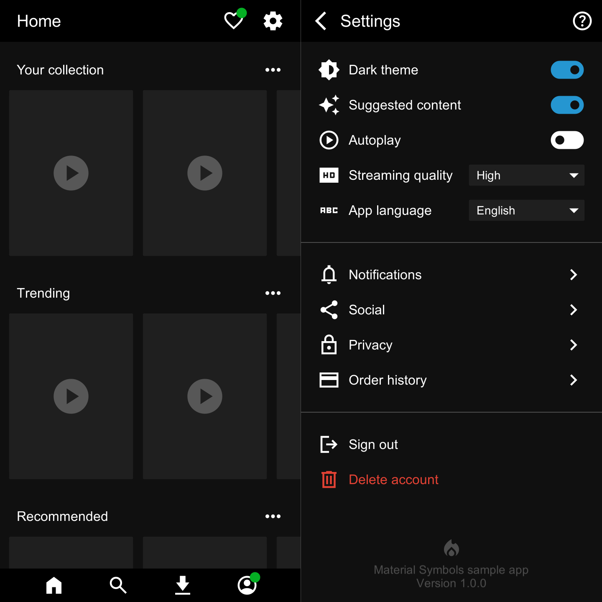
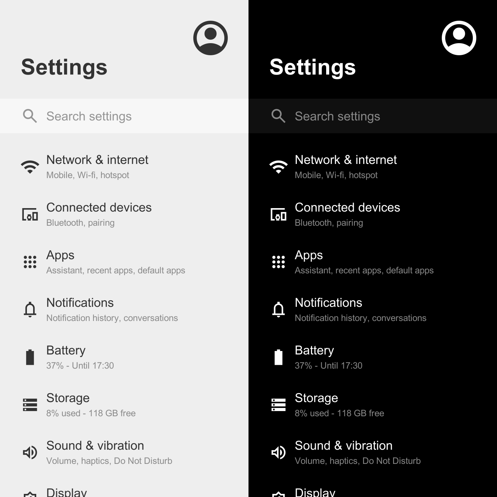
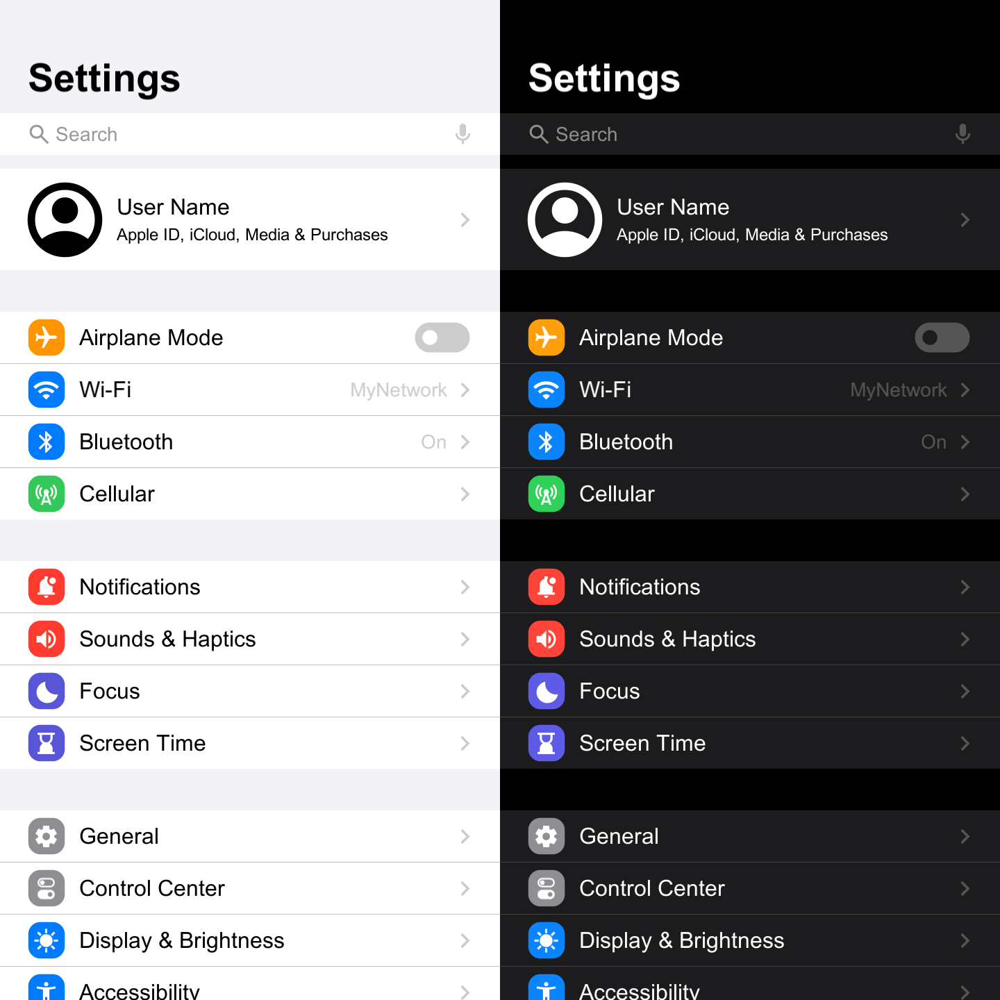

# Material Symbols (Icons) for Unity
[](http://makeapullrequest.com)

An add-on that simplifies the use of Google’s **Material Symbols** (formerly Material Icons) in Unity.  
It provides a lightweight, consistent icon set for UI and editor tooling.

**Recommended Unity version:** 2022 or higher  
**Supported Unity version:** 2017 or higher

## Samples Gallery

<a href='https://raw.githubusercontent.com/convalise/unity-material-symbols/master/doc/sample-1.png'></a> <a href='https://raw.githubusercontent.com/convalise/unity-material-symbols/master/doc/sample-2.png'></a> <a href='https://raw.githubusercontent.com/convalise/unity-material-symbols/master/doc/sample-3.png'></a>


## Changes

Initial Forked Version -  `v226.0.0`

Based on the original project by [Convalise](https://github.com/convalise)\
URL: https://github.com/convalise/unity-material-symbols

This forked version introduces significant [changes](https://github.com/ebukaracer/unity-material-symbols-v2/blob/v2/CHANGES.md#changes-made-in-the-upm-branch) organized into this [branch](https://github.com/ebukaracer/unity-material-symbols-v2/tree/upm)

## Installation
- Open the Unity Package Manager
- Click the (+) button.
- Select **Install package from git URL**.
- Enter the URL below and click **Install**:
   ```text
   https://github.com/ebukaracer/unity-material-symbols-v2.git#upm
   ```

If your project uses **Assembly Definitions**, add a reference to this package's assembly under **Assembly Definition References**.

For additional setup information, see the [Setup Guide](https://ebukaracer.github.io/ebukaracer/md/SETUPGUIDE.html)

## Setup
- Add the `MaterialSymbol` component to any UI GameObject.
- Or right click and create one from the hierarchy via: **Google > New Material Symbol**.
- Once created, use the inspector to browse and select available symbols.

## Usage Examples
The `MaterialSymbol` inherits from `UnityEngine.UI.Text`, so it supports the usual `Text` [properties and methods](https://docs.unity3d.com/Packages/com.unity.ugui@1.0/manual/script-Text.html). 

Each icon is defined by:
- a unicode-escaped character for the symbol
- a boolean value for the fill state
### Set the symbol in code
```cs
public class Demo : MonoBehaviour  
{  
	private MaterialSymbol _materialSymbol;
	
	private void Start()  
	{  
		_materialSymbol.Symbol = new MaterialSymbolData('\uEF55', false);  
	}
}
```

### Set the code and fill properties directly
```cs
_materialSymbol.Code = '\uEF55';  
_materialSymbol.Fill = false;
```

### Use a serialized field in the inspector
```cs
public class Demo : MonoBehaviour  
{  
	private MaterialSymbol _materialSymbol;
	
	[SerializeField]
	private MaterialSymbolData symbolData;
	
	private void Start()  
	{  
		_materialSymbol.Symbol = symbolData;  
		_materialSymbol.color = Color.blue;
	}
}
```

## Notes
### Using the Config Asset
The **Config Asset** is available at:
-  `Packages > MaterialSymbols > Resources > MaterialSymbolConfig` 

It can be used to edit settings such as the output location for generated symbol images
### Removing the Package
To remove the package completely, 
- navigate to: `Racer > Google > Remove Package`

## Credits
This project was created originally by Conrado ([convalise](https://github.com/convalise)) as an improvement of the deprecated [Unity Material Icons](https://github.com/convalise/unity-material-icons).

It uses the [Material Design icons by Google (Material Symbols)](https://github.com/google/material-design-icons).

More information about Google's project can be found in the [Material Symbols Guide](https://developers.google.com/fonts/docs/material_symbols).

See [Original Docs](https://github.com/convalise/unity-material-symbols?tab=readme-ov-file#documentation).

See [FAQs](https://github.com/convalise/unity-material-symbols#FAQ).